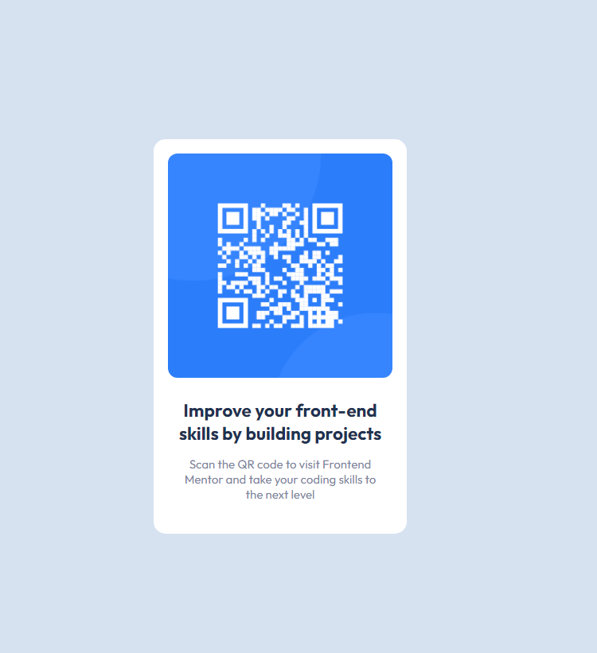

# Frontend Mentor - QR code component solution

This is a solution to the [QR code component challenge on Frontend Mentor](https://www.frontendmentor.io/challenges/qr-code-component-iux_sIO_H). Frontend Mentor challenges help you improve your coding skills by building realistic projects. 

## Table of contents

- [Overview](#overview)
  - [Screenshot](#screenshot)
  - [Links](#links)
- [My process](#my-process)
  - [Built with](#built-with)
  - [What I learned](#what-i-learned)
  - [Useful resources](#useful-resources)
- [Author](#author)

## Overview

### Screenshot




### Links

- Solution URL: [Add solution URL here](https://your-solution-url.com)
- Live Site URL: [Add live site URL here](https://your-live-site-url.com)

## My process

### Built with

- Semantic HTML5 markup
- CSS custom properties
- Flexbox
- CSS Grid

### What I learned

This code is quite simple, perfect for beginners to learn basic html and css concepts. In the html, the main tag will wrap all the main content of the page created in the body, which houses another div "card", where all the content of the card (image and texts) will be.

```html
  <body>
    <main>
        <div class="card">
          
          <div class="text">
            <h1>
              Improve your front-end skills by building projects 
            </h1>
            <p>
              Scan the QR code to visit Frontend 
              Mentor and take your coding skills to 
              the next level
            </p>
          </div>
        </div>  
    </main> 
  </body>
  ```


It is not recommended to use an img tag directly as it changes all elements that use that tag.
However, since the project only has one image, let's keep things simple.

```css
.card img {
    width: 100%;
    border-radius: 12px;
}
```

### Useful resources

- [Desafio Front-end Mentor #1 - QR code component](https://www.youtube.com/watch?v=rI4LvtPmPXU&ab_channel=LuisEduardo) - This tutorial helped me a lot. I really liked this pattern and will use it going forward.

- [Accesibility with landmarks](https://dequeuniversity.com/rules/axe/4.3/region?application=axeAPI) - Helped me to learn about good accessibility practices using landmark correctly.

- [Alternative text](https://webaim.org/techniques/alttext/) - Some tips on using alt text to improve accessibility.

## Author

- Frontend Mentor - [@jadefurtado](https://www.frontendmentor.io/profile/jadefurtado)


